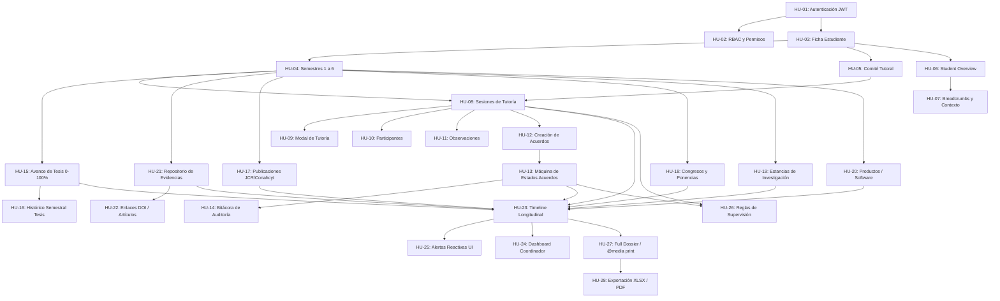

# Matriz Refinada de Dependencias Técnicas del Product Backlog
**Proyecto:** N.E.X.U.S. (Núcleo de Expediente y Seguimiento Universitario Superior)  
**Documento:** `refined_dependencies_matrix.md`  
**Autor:** nexus-orchestrator (Tech Lead & Meta-Architect)

---

## 1. Justificación del Reordenamiento Técnico
Durante la ejecución del proyecto se observó que la secuencia original de Historias de Usuario generaba cuellos de botella temporales (ej. intentar renderizar el Timeline sin contar con los contratos de Tesis o Evidencias concluidos).

La siguiente matriz presenta el **orden óptimo de implementación técnica** de las 28 Historias de Usuario (HU-01 a HU-28), eliminando dependencias circulares y optimizando el flujo de trabajo en paralelo para 3 equipos de desarrollo.

---

## 2. Matriz de Dependencias y Ruta Crítica

---

## 3. Desglose Secuencial y Asignación por Equipos

| Orden de Ejecución | HU ID | Nombre de la Historia de Usuario | Equipo Responsable | Prerrequisitos Estrictos | Salida Técnica Esperada |
|:---:|:---:|:---|:---:|:---|:---|
| **1** | **HU-01** | Autenticación JWT y Tokens | Equipo 1 | Ninguno | `CustomUser`, `/api/v2/auth/login/` |
| **2** | **HU-02** | RBAC y Permisos por Rol | Equipo 2 | HU-01 | Permisos `IsCoordinator`, `IsAssignedAdvisorOrStudent` |
| **3** | **HU-03** | Ficha del Doctorando | Equipo 1 | HU-01, HU-02 | Modelo `Student`, `/api/v2/students/` |
| **4** | **HU-04** | Semestres 1 a 6 y Periodos | Equipo 1 | HU-03 | Modelo `Semester`, `/api/v2/semesters/` |
| **5** | **HU-05** | Comité Tutoral y Asesores | Equipo 2 | HU-03 | Modelo `AcademicCommittee` |
| **6** | **HU-06** | Student Overview (Tabs & Grid 70/30) | Equipo 1 | HU-03, HU-04, HU-05 | Layout Angular con Signals |
| **7** | **HU-07** | Breadcrumbs y Contexto Global | Equipo 3 | HU-06 | Top Navbar y navegación |
| **8** | **HU-08** | Registro de Sesiones de Tutoría | Equipo 1 | HU-04, HU-05 | Modelo `TutoringSession` |
| **9** | **HU-09** | Modal 2 Columnas de Tutoría | Equipo 1 | HU-08 | Componente `TutoringModalComponent` |
| **10** | **HU-10** | Participantes y Asistencia | Equipo 1 | HU-08 | Modelo `TutoringParticipant` |
| **11** | **HU-11** | Observaciones de Sesión | Equipo 1 | HU-08 | Modelo `TutoringObservation` |
| **12** | **HU-12** | Registro de Acuerdos y Compromisos | Equipo 2 | HU-08 | Modelo `Agreement`, Drawer 400px |
| **13** | **HU-13** | Máquina de Estados de Acuerdos | Equipo 2 | HU-12 | Transición 4 estados con semáforo |
| **14** | **HU-14** | Bitácora de Auditoría de Acuerdos | Equipo 2 | HU-13 | Modelo `AgreementAuditLog` |
| **15** | **HU-15** | Registro de Avance de Tesis (0-100%) | Equipo 2 | HU-04 | Modelo `ThesisProgress` con JSON |
| **16** | **HU-16** | Comparativa Histórica de Tesis (Sem 1-6) | Equipo 1 | HU-15 | Endpoint `/thesis/history/` y barras UI |
| **17** | **HU-21** | Repositorio de Evidencias (15MB máx) | Equipo 2 | HU-04 | Modelo `Evidence`, subida multipart |
| **18** | **HU-22** | Validación y Enlaces DOI de Evidencias | Equipo 2 | HU-21 | Validación regex DOI / URL externa |
| **19** | **HU-17** | Publicaciones Científicas JCR/Conahcyt | Equipo 1 | HU-04, HU-21 | Modelo `Publication` y DTOs |
| **20** | **HU-18** | Congresos y Ponencias Académicas | Equipo 1 | HU-04, HU-21 | Modelo `AcademicEvent` y sub-tabs |
| **21** | **HU-19** | Estancias de Investigación | Equipo 1 | HU-04, HU-21 | Modelo `ResearchStay` |
| **22** | **HU-20** | Productos de Software y Patentes | Equipo 1 | HU-04, HU-21 | Modelo `OtherProduct` |
| **23** | **HU-23** | Timeline Longitudinal (8 Tipos de Nodos) | Equipo 3 | HU-08, HU-13, HU-15, HU-17..22 | Vertical Timeline con Flyout Drawer |
| **24** | **HU-25** | Alertas Reactivas y Badges de Vencimiento | Equipo 3 | HU-13, HU-23 | Campana de notificaciones y pills |
| **25** | **HU-24** | Dashboard del Coordinador (KPIs & Riesgo) | Equipo 3 | HU-13, HU-15, HU-23 | Semáforos de riesgo (Alto/Medio/Bajo) |
| **26** | **HU-26** | Motor de Reglas de Supervisión Activa | Equipo 2 | HU-08, HU-13 | Regla >45 días, sin evidencia, 7 días |
| **27** | **HU-27** | Cédula Full Dossier y Vista `@media print` | Equipo 3 | HU-23 | Endpoint consolidado y hoja oficial |
| **28** | **HU-28** | Motor de Exportación XLSX y PDF | Equipo 1 | HU-27 | Servicios binarios `openpyxl` / `reportlab` |
